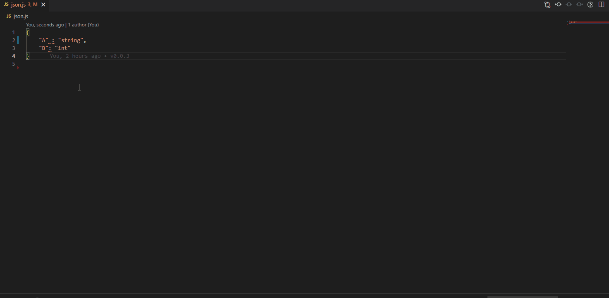

# json-to-jsmodel-class

将后端接口设计返回的 json 对象转换为 jsdoc typescript 的 class 实体模型。

## 效果图

允许您选择一个 json 模型，其中属性名称是属性，属性值是类型，并将其转换为具有 jsdoc 定义的 ts class类



- 先把接口返回的json对象粘贴到一个新建的ts文件，然后全选选中全部的json模型
- 右键菜单，然后选择`Convert to JS Model Class`菜单
- 输入自定义的类名或按 Enter 键获取默认值（当前的文件名作为最顶部的类名）

## 转化后的基本class结构

```ts
export class CurrentUser {
	 employeeID: string
	 loginID: string
	 name: string
	 docLevel: string
	 docLevelName: string
	 pwdIsExpired: string
	 pwdIsSimple: string
	/**
	 * @typedef  {Object} CurrentUser
	 * @property {string} employeeID
	 * @property {string} loginID
	 * @property {string} name
	 * @property {string} docLevel
	 * @property {string} docLevelName
	 * @property {string} pwdIsExpired
	 * @property {string} pwdIsSimple
	 */
	constructor({ employeeID, loginID, name, docLevel, docLevelName, pwdIsExpired, pwdIsSimple } = {} as any) {
		this.employeeID = employeeID;
		this.loginID = loginID;
		this.name = name;
		this.docLevel = docLevel;
		this.docLevelName = docLevelName;
		this.pwdIsExpired = pwdIsExpired;
		this.pwdIsSimple = pwdIsSimple;
	}
}

```

## 打包VSIX 文件格式

```sh
vsce package
```

## 手动发布VSIX包

打开vscode后台发布地址：[Manage Publishers & Extensions](https://marketplace.visualstudio.com/manage/publishers)