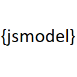

 
# json-to-jsmodel

Converts the selected json object to a javascript model.

## Features

Allows you to select a json model where the property name is the property and the property value is the type and convert it into a js class with jsdoc definitions

- Select the json object
- Right click then select Convert to JS Model or ctrl+shift+p type and select Convert to JS Model
- Enter a class name or press enter for the default

## Requirements

Requires visual studio > v1.55.2

## Extension Settings

None

## Known Issues

Can not handle nested objects

## Release Notes

### 0.0.1

Initial release

### 0.0.2

Fixed bug where property type was swapped with property name in constructor

### 0.0.3

Add support for vs code 1.55.2

**Enjoy!**
